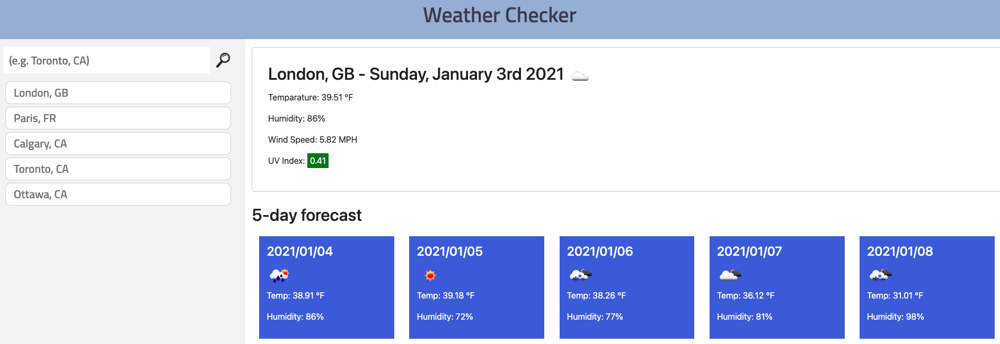

# weather-dashboard
Weather forecast dashboard

Link https://r-a-exe.github.io/weather-dashboard/

## High-Level Description

Weather forecasting dashaboard showing the current weather, as well as the next 5 days' weather in a chosen city. A search history is available in the side pane, giving easy access to searched cities.

## Searching a city

Typing the name of a city in the search bar and clicking the search button will prompt the website to find the weather information of the chosen city, and display it on the page. An invalid search value will prompt an error message under the search bar, leaving the typed text available to rectify and search again.

## Side bar

Upon searching a valid entry, the city name is added to the list in the side bar for easy access. Clicking on any city in the sidebar will prompt a search and display of the information of that city.

The array of search history is saved in internal storage for long term access even after the page is reopened.

Lastly, the most recent search is displayed upon loading the page.

## Main section

The webpage fetches the data from [OpenWeatherMap](https://openweathermap.org/api), using the Current Weather Data API and the 5 day forecast API.

The top section, using the information from the Current Weather API, displays current termparature, humidity, wind speed and uv index (color coded).

The bottom section, using the 5 day forecase API, displays the temparature and humidity for the next 5 days.